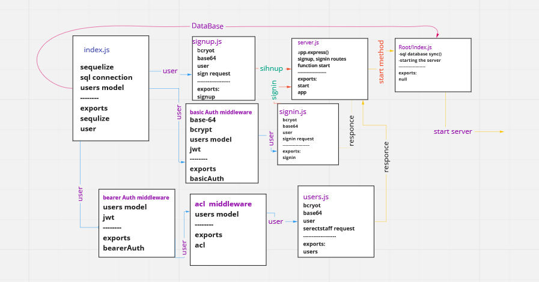

# Final-Auth-Project

A backend project for student and teachers, the teacher adds homeworks and can edit delete gets and create new homeworks
and the student can only read the homeworks
We used authentication and authorization using token and JWT package

### The end points:

1. /signin
2. /signup
3. /user
4. /users/homeWCollect

* [Salam PR link](https://github.com/moathabuhamad/Final-Auth-Project/pull/2)

* [Moath PR link](https://github.com/moathabuhamad/Final-Auth-Project/pull/1)

* [Moath PR](https://github.com/moathabuhamad/Final-Auth-Project/pull/3)

* [Action link](https://github.com/moathabuhamad/Final-Auth-Project/actions)

* [Heroku PR link](https://final-api-project-401.herokuapp.com/)

### UML Diagram

